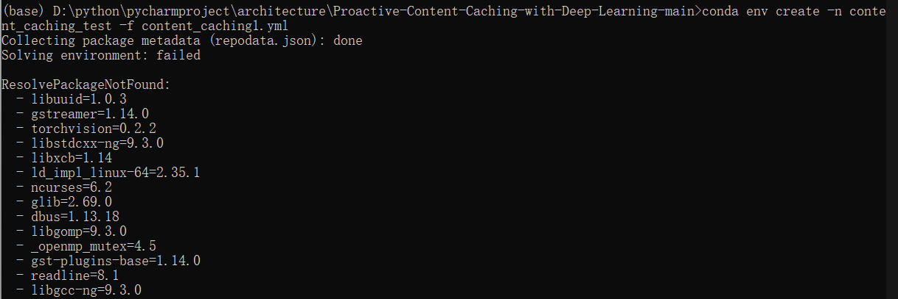

# Content Caching reproduction

在windows环境下打开anaconda prompt，cd到所要配置虚拟环境的文件夹

## 依赖的下载：
* python==3.7
* pandas==0.24.2
* numpy==1.16.2
* pytorch==1.7.1
* gensim==3.7.1
* tensorboardX>=1.6 (mainly useful when you want to visulize the loss, see https://github.com/lanpa/tensorboard-pytorch)

* 将yml文件放到前面创建的文件夹中，将文件中每一个库第二个等号及后面的配置信息删除，将文件C:/user/your_username/.condarc中的信息更改为清华源（或其他可用镜像源）：

channels:
  - https://mirrors.tuna.tsinghua.edu.cn/anaconda/pkgs/free/
  - https://mirrors.tuna.tsinghua.edu.cn/anaconda/cloud/menpo/
  - https://mirrors.tuna.tsinghua.edu.cn/anaconda/cloud/bioconda/
  - https://mirrors.tuna.tsinghua.edu.cn/anaconda/cloud/msys2/
  - https://mirrors.tuna.tsinghua.edu.cn/anaconda/cloud/conda-forge/
  - https://mirrors.tuna.tsinghua.edu.cn/anaconda/pkgs/main/
  - defaults
show_channel_urls: true


## 使用如下语句直接导入yml文件
```
conda create env export content_caching.yml
```


## 常见错误的解决方法
若没有报错则成功安装，若出现依赖项报错，则再将yml文件中的依赖项先删去，成功下载后再使用```pip```或```conda install``` 安装。

当出现此时的错误时，将yml文件中对于的依赖项删去，等待顺利安装完成后再逐个进行pip安装。（或者再代码运行时，通过查看哪一个库无法import再逐个安装）。



如果这种方法仍在安装时产生过多库冲突，则直接创建content_caching 环境，根据main运行时缺少的库与本地环境进行逐个安装。
在这里下载训练所需的数据。
```
https://drive.google.com/drive/folders/1Keww2JHH4Pqx_Oe5Q6hp641t-weU2vPd?usp=sharing
```

在项目中提供我本地conda环境的yml文件：mycontent_caching.yml
